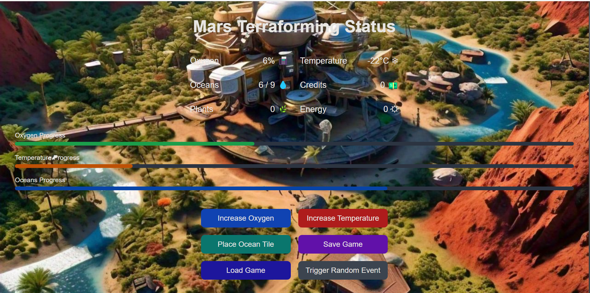

🌌 Terraforming Mars Game 🌍 🚀

Welcome to Terraforming Mars, a resource-management game where players aim to transform the Martian environment by increasing oxygen, temperature, and oceans! This game is built with modern technologies to provide a clean, responsive, and immersive experience. Engage with resources, trigger random events, and watch Mars slowly become habitable! 🪐

🔥 Features

Dynamic Backgrounds 🎨: Backgrounds change every 60 seconds for a refreshing visual experience.
Resource Management 🌿🔋: Track and control resources like oxygen, temperature, credits, plants, and energy.
Random Events System 🎲: Gain or lose resources with random in-game events.
Save & Load Game 💾: Save your progress and load it anytime.
Responsive UI 📱: Modern, clean, and mobile-friendly design.
Progress Tracking 📊: Visual progress bars for oxygen, temperature, and oceans.

📸 Screenshots

🚀 Tech Stack

Frontend: React.js
State Management: Redux Toolkit
Styling: Tailwind CSS
Toast Notifications: react-toastify
Icons & Emojis: Unicode emojis integrated for better UX

🛠️ Installation & Setup

Prerequisites
Make sure you have the following installed:

Node.js
npm or yarn
Clone the Repository
bash
Copy code
git clone https://github.com/gidi007/terraforming-mars-game.git
cd terraforming-mars-game

Install Dependencies
bash
Copy code
npm install
Run the App
bash
Copy code
npm run dev
The app will run at http://localhost:3000.

🎮 How to Play

Increase Resources: Use buttons to increase oxygen, temperature, and place ocean tiles.
Trigger Events: Experience random events that can either boost or deplete resources.
Save & Load: Save your game progress and load it anytime you return.
Win Condition: Terraform Mars by completing all resource goals (oxygen, temperature, and oceans).

🧑‍💻 Code Structure
bash
Copy code
/public
│── /images                 # Backgrounds and screenshots
/src
│── /components             # React components for UI
│── /redux/slices           # Redux state management logic
│── GameBoard.js            # Main game board component
│── index.js                # Entry point
/tailwind.config.js         # Tailwind CSS configuration

📦 Dependencies

Package	          Version	       Description
react	          ^18.2.0	       Frontend library
redux	          ^8.0.5	       State management
react-toastify	  ^9.1.2	      Toast notifications
tailwindcss	      ^3.3.2     	  Utility-first CSS framework
 

🎉 Upcoming Features
Tutorial and Guided tour for new players 🥇 
Production and Infrastructure Management 🏢
Research management for developing technologies 🔎 
Player Leaderboards 🏆
Multiplayer Mode 👫
Mars Exploration Missions 🚀
Achievements System 🥇

🐛 Issues & Contributions

Found a bug? Want to contribute?
Feel free to open an issue or make a pull request: GitHub Issues.

✨ Credits
 This project was created with ❤️ by [Gideon Bawa| gidi007].

📄 License
 This project is licensed under the MIT License - see the LICENSE file for details.

📊 GitHub Stats & Widgets

🤝 Connect with Me
@kieriantirian@gmail.com
+2349060390237

Enjoy the game and happy terraforming! 🌍🚀🎮

